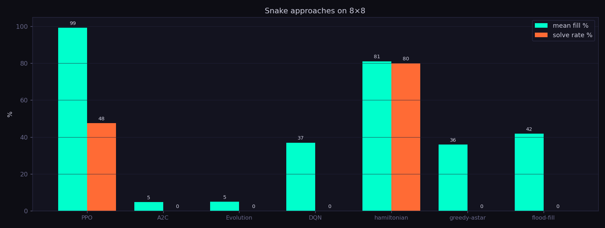

# 🐍 Snake PPO — Reinforcement Learning on Apple Silicon

Train a PPO agent to play Snake, entirely on the Apple M-series GPU via **MLX**, with
beautiful **moderngl** (GLSL) rendering, per-checkpoint video export, and live
visualisation of *what the network is thinking* while it plays.

Built as a testbed for exploring the M4's GPU and Neural Engine through a fun, visual,
and surprisingly deep little game.


## A self-taught solve

<p align="center"></p>

<p align="center"><em>One continuous game: a self-taught PPO agent growing from a 3-cell stub to
<b>filling the entire 8×8 board</b> (64/64) — +1 length per apple, all the way. No hand-coded
Hamiltonian cycle, no safety shield; the coverage strategy was discovered entirely from a
<code>+1 eat / −1 die</code> reward (plus a small win bonus).</em></p>

## Comparing approaches

Different agents share one environment and one evaluation harness
(`python -m snake.eval` / `python -m snake.compare`), so they can be compared
head-to-head on solve-rate and board fill:

<p align="center"></p>

<p align="center"></p>

<p align="center"><em>Same game, seven agents (8×8, 40 episodes each). Results:</em></p>

| Agent | Type | Mean fill | Solve rate |
|-------|------|-----------|-----------|
| **PPO** | learned (clipped policy-gradient) | **99%** | 48% |
| Hamiltonian cycle | hand-coded | 81% | **80%** |
| flood-fill | hand-coded | 42% | 0% |
| DQN | learned (value-based) | 37% | 0% |
| greedy-A* | hand-coded | 36% | 0% |
| A2C | learned (no clipping) | 5% | 0% |
| Neuroevolution | gradient-free | 5% | 0% |

<p align="center"><em>Takeaways: <b>PPO</b> reaches the highest fill of any agent (99%, above even the
hand-coded Hamiltonian), and is the only learned method that solves the board. <b>DQN</b> learns to
eat but not to complete. <b>A2C</b> (PPO minus the clipping) collapses — clipping is what makes PPO
stable. <b>Neuroevolution</b> barely moves at this budget — gradient-free search is far less
sample-efficient. All learned methods trained on the same 20M-step budget.</em></p>

## Features

- **PPO from scratch in MLX** — clipped surrogate objective, GAE, entropy bonus,
  gradient clipping. Runs natively on the Apple GPU (Metal), no CUDA, no PyTorch.
- **CNN actor-critic** — 3 conv layers + shared trunk → policy head (3 relative actions:
  turn-left / straight / turn-right) + value head.
- **256 parallel environments** — vectorised NumPy Snake, ~5–6k env-steps/sec on an M4.
- **moderngl rendering** — GLSL shaders: snake body gradient (head→tail), pulsing food
  glow, value-function heatmap overlay. Offscreen for video, windowed for live watching.
- **Video pipeline** — one greedy episode rendered per checkpoint (clean + heatmap
  variants), stitched into a learning-progress timelapse via ffmpeg.
- **Live visualisation** while watching a trained policy:
  - 🎮 the game itself, with **visible crashes** (red death flash)
  - 📊 training curves (reward / episode length / entropy)
  - 🧠 **policy panel** — live action probabilities, conv feature-map montages, and a
    network diagram lit by activation flow

## Setup

```bash
conda create -n snake python=3.13 -y
conda activate snake
pip install -r requirements.txt
```

Requires Apple Silicon (M1–M4) and `ffmpeg` on PATH (`brew install ffmpeg`).

## Usage

### Train

```bash
python -m snake.train --config configs/quick.json      # 8×8 smoke test (~minutes)
python -m snake.train --config configs/medium.json     # 16×16
python -m snake.train --config configs/overnight.json  # 32×32, 200M steps (~overnight)
```

Each run creates `runs/<timestamp>/` with `checkpoints/`, `videos/`, `metrics.jsonl`,
and a final `timelapse.mp4`. A live tqdm progress bar shows reward, episode length,
entropy, and throughput.

Training flags:

| Flag | Effect |
|------|--------|
| `--resume` | Continue from the latest checkpoint in `--run-dir` |
| `--no-video` | Skip per-checkpoint video archive + timelapse (faster) |
| `--no-preview` | Disable the rolling `preview.mp4` |

A rolling **`preview.mp4`** of the *current* policy is rendered every N iterations
(every 1000 for long runs, ~10 previews otherwise) and overwritten in place — a
lightweight way to eyeball progress mid-run even with `--no-video`. `Ctrl+C`
checkpoints cleanly before exiting.

### Watch a trained policy

```bash
python -m snake.watch --run runs/<timestamp> --loop
```

Add any combination of visualisations:

| Flag | Shows |
|------|-------|
| `--heatmap` | value-function heatmap overlaid on the game |
| `--policy`  | live action probabilities, conv feature maps, network diagram |
| `--plots`   | live training curves (updates while training runs concurrently) |
| `--loop`    | auto-restart after death / max-steps |
| `--fps N`   | playback speed (default 10) |

**Controls** (focus the game *or* any panel window): `Q` quit · `SPACE` pause ·
`↑/↓` speed.

## Configuration

All hyperparameters live in `configs/*.json` — grid size, number of envs, rollout
length, PPO epochs, learning rate, γ, GAE λ, clip ε, entropy coefficient, checkpoint
interval, render resolution. Copy one and tweak.

## Project layout

```
snake/
├── env.py           # vectorised Snake environment (NumPy)
├── network.py       # CNN actor-critic (MLX) + activation introspection
├── ppo.py           # rollout buffer, GAE, PPO update
├── checkpoint.py    # save/load weights + metadata
├── renderer.py      # moderngl offscreen + windowed renderer (GLSL)
├── recorder.py      # per-checkpoint videos + timelapse assembly
├── plots.py         # live training-curve panel (matplotlib)
├── policy_panel.py  # live policy / feature-map / network-diagram panel
├── train.py         # training entry point
├── watch.py         # live watch entry point
└── config.py        # config loading + validation
```

## How it works

The snake sees a 3-channel grid (body-age / food / head). The CNN maps that to a policy
over **relative** moves — making U-turns physically impossible, which kills off a whole
class of trivial deaths and produces smoother, more "meditative" trajectories as
training converges. On large grids the policy gradually rediscovers Hamiltonian-style
sweeping loops purely from the `+1 food / −1 death` reward.

## Documentation

Full docs live in [`docs/`](docs/):

| Doc | Covers |
|-----|--------|
| [architecture](docs/architecture.md) | System overview, data flow, module map |
| [environment](docs/environment.md) | State, observation channels, actions, reward, collisions, shaping |
| [algorithm](docs/algorithm.md) | PPO: network, GAE, clipped objective, the update |
| [training](docs/training.md) | Pipeline, CLI, checkpoints, metrics, rolling preview |
| [visualization](docs/visualization.md) | Renderer, watch mode, policy panel, plots, video export |
| [configuration](docs/configuration.md) | Every config field + the shipped presets |

Design rationale (why MLX, relative actions, the CNN, etc.) is recorded in the
OpenSpec change at [`openspec/changes/snake-ppo/`](openspec/changes/snake-ppo/).
Open questions and future directions are collected in [`IDEAS.md`](IDEAS.md).

## License

MIT — see [LICENSE](LICENSE).
